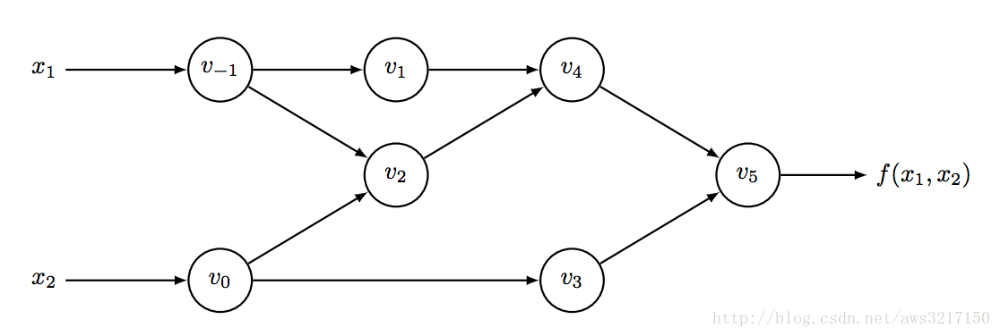

Auto Derivative
====

所有的数值计算归根结底是一系列的可微算子的组合。自动微分法将符号微分应用于最基本的算子，即利用连式法则
将整体的微分分解为一个个简单的运算单元，再根据每个单元运算的各自的微分形式组合成整体的微分。

<!--

| Node			| illustration			|
| --------- | --------- |
| $$v_{-1}$$	| $$x_1$$				|
| $$v_0$$		| $$x_0$$				|
| $$v_1$$		| $$ln(v_{-1})$$		|
| $$v_2$$		| $$v_{-1}v_0$$			|
| $$v_3$$		| $$sin(v_0)$$			|
| $$v_4$$		| $$v_1+v_2$$			|
| $$v_5$$		| $$v_4-v_3$$			|-->

Forward Mode
----

<!--我们在每个边上求对应的偏微分
| Edge			| illustration			|
| --------- | --------- |
| $$v_{-1}->v_1$$		| $$\frac{\partial v_1}{\partial v_{-1}}=\frac{1}{v{-1}}$$		|
| $$v_{-1}->v_2$$		| $$\frac{\partial v_{2}}{\partial v_{-1}}=v_0$$			|
| $$v_{0}->v_2$$		| $$\frac{\partial v_{2}}{\partial v_{0}}=v_{-1}$$			|
| $$v_0->v_3$$		| $$\frac{\partial v_{3}}{\partial v_0}=cos(v_0)$$			|
| $$v_1->v_4$$		| $$\frac{\partial v_4}{\partial v_1}=1$$			|
| $$v_2->v_4$$		| $$\frac{\partial v_4}{\partial v_2}=1$$			|
| $$v_4->v_5$$		| $$\frac{\partial v_5}{\partial v_4}=1$$			|
| $$v_3->v_5$$		| $$\frac{\partial v_5}{\partial v_3}=-1$$			|

在每个边上逐步相乘，最终可得到整体的偏微分。-->

Reverse Mode
----

Dynamic graph
----

Static graph
----
